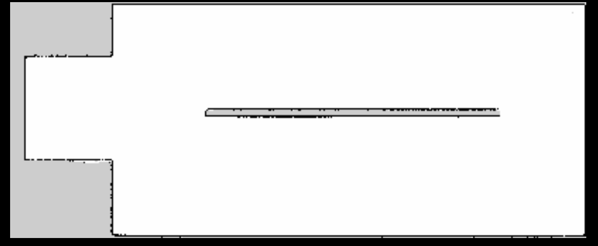
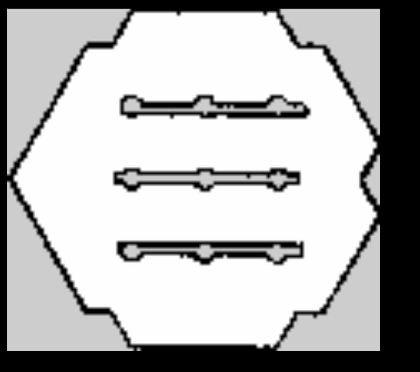

Markdown

# 🚜 Husky Greenhouse Autonomous Exploration & Navigation System

An optimized ROS 2 (Humble) autonomous SLAM exploration and navigation pipeline tailored for narrow greenhouse corridors using a Clearpath Husky Unmanned Ground Vehicle (UGV).

---
### 🎯 Project Goal

Develop a fully autonomous Husky UGV capable of exploring, mapping, and navigating narrow greenhouse corridors without human intervention while maintaining safe row-centered motion and reliable obstacle avoidance.
---
## 📌 Project Overview

Operating mobile robots in agricultural environments like greenhouses presents unique technical challenges: narrow row spacing, tight turning radiuses, repetitive corridor features, and frequent dynamic obstacles. 

This project delivers a specialized navigation suite optimized specifically for **greenhouse row dynamics**. By combining **Frontier Exploration**, **SLAM Toolbox**, and **Nav2 (Regulated Pure Pursuit Controller)**, the Husky robot seamlessly maps the greenhouse, centers itself along narrow crop rows, handles tight dead-end reversals, and autonomously navigates to designated coordinates.

---

## 📽️ Demos & Visualizations

### 1. Autonomous Greenhouse Mapping (Frontier Exploration)
The robot systematically navigates unexplored greenhouse aisles, continuously updating the occupancy grid via LiDAR and EKF-fused odometry.


### 2. Narrow Corridor & Obstacle Avoidance Performance
Demonstrating smooth path-following, obstacle avoidance in restricted spaces, and bidirectionality (forward/backward movement without unnecessary zero-radius turns in tight spots).


### 3. Generated High-Precision Occupancy Grid Map
Due to fine-tuned costmap inflation radiuses and sensor filtering, the resulting map produces sharp, clean obstacle boundaries for precise waypoint targeting.




---

## 👨‍💻 My Technical Contributions

- **Developed a Custom Frontier Exploration Node:** Implemented a ROS 2 Python node for autonomous frontier detection, goal selection, and greenhouse exploration without manual intervention.
- **Optimized Navigation for Narrow Greenhouse Corridors:** Tuned Nav2's Regulated Pure Pursuit Controller and costmap parameters to maintain centered navigation between crop rows while minimizing wall-hugging behavior.
- **Implemented Bidirectional Navigation Behavior:** Configured the navigation stack to support efficient forward and reverse motion, reducing unnecessary in-place rotations and improving maneuverability in dead-end aisles.
- **Integrated Multi-Sensor Localization:** Combined LiDAR odometry, IMU filtering (`imu_filter_madgwick`), and `robot_localization` EKF to improve localization stability in repetitive greenhouse environments.
- **Designed Custom Greenhouse Simulation Environments:** Created greenhouse worlds in Gazebo for testing autonomous exploration, mapping, and navigation under realistic corridor constraints.
- **Built a Unified Autonomous Pipeline:** Integrated Gazebo, SLAM Toolbox, Frontier Exploration, Nav2, EKF localization, and waypoint navigation into a single launch workflow for fully autonomous operation.
---
## ✨ Key Engineering Features & Optimizations

* **🌿 Narrow Corridor Centering:** The Nav2 local planner (`RegulatedPurePursuitController`) is heavily tuned with tailored inflation boundaries and cost scaling factors. The robot consistently stays centered between greenhouse rows rather than hugging wall edges.
* **🔄 Bidirectional Motion (No-Front Preference):** Greenhouse corridors often do not allow 180° rotations. The control configuration enables smooth forward and reverse maneuvers without requiring full turns at dead ends.
* **🎯 Autonomous Waypoint Navigation:** Includes custom node integration allowing operators to publish exact target coordinates ($x, y, \theta$) directly to Nav2 for autonomous task execution (e.g., automated harvesting or spraying inspection points).
* **🧹 Clean Mapping Resolution:** Asynchronous `slam_toolbox` optimized alongside IMU data fusion (`imu_filter_madgwick` & `robot_localization` EKF) eliminates drift caused by repetitive row patterns.
* **⚡ High-Performance Event-Driven Launch System:** Time-delayed and event-triggered node management prevents CPU overload during Gazebo/RViz startup sequence.

---

## 📁 Repository Structure

```text
husky_greenhouse_explorer/
├── config/                 # Parameter files for EKF, SLAM, IMU, and Nav2
│   ├── husky_nav.yaml      # Optimized Regulated Pure Pursuit & Costmap parameters
│   ├── husky_slam_params.yaml
│   ├── ekf.yaml
│   └── imu_filter.yaml
├── launch/                 # Modular ROS 2 launch orchestration
│   └── sera_robot_launch.py
├── worlds/                 # Custom Gazebo greenhouse environments (.world)
├── media/                  # Demo GIFs and map visual artifacts
└── src/                    # Frontier explorer & goal targeting ROS 2 nodes
```
🚀 Quick Start & Usage
1. Prerequisites

    OS: Ubuntu 22.04 LTS

    ROS 2: Humble Hawksbill

    Simulator: Gazebo Classic

2. Build the Workspace
Bash

cd ~/sera_husky_project
colcon build --symlink-install
source install/setup.bash

3. Launch the Full Autonomous Pipeline

To start Gazebo, Husky EKF localization, SLAM, Nav2 stack, and Autonomous Frontier Explorer simultaneously:
Bash

ros2 launch frontier_explorer sera_robot_launch.py

4. Sending Autonomous Coordinate Goals

Once the map is generated, send a direct navigation goal to any greenhouse coordinate:
Bash

ros2 topic pub /goal_pose geometry_msgs/msg/PoseStamped "{
  header: {frame_id: 'map'},
  pose: {
    position: {x: 2.5, y: -1.0, z: 0.0},
    orientation: {w: 1.0}
  }
}"

🛠️ Technical Stack

    Robot Hardware Model: Clearpath Husky UGV

    Simulation: Gazebo

    Localization & Mapping: slam_toolbox, robot_localization (EKF), imu_filter_madgwick

    Navigation & Control: Nav2 (RegulatedPurePursuitController), frontier_explorer

Developed as part of an autonomous greenhouse robotics exploration project.
